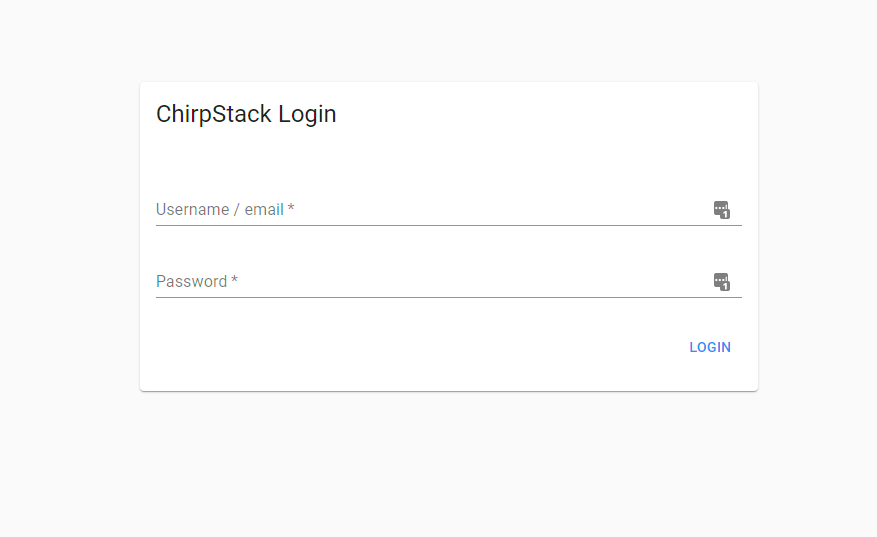
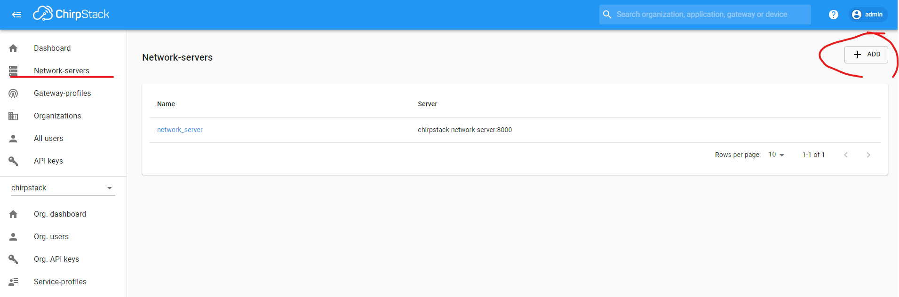
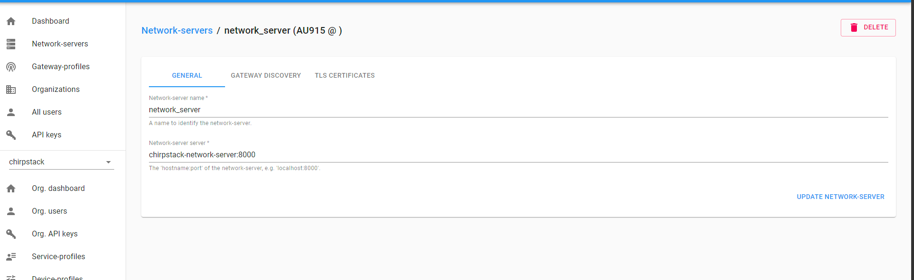
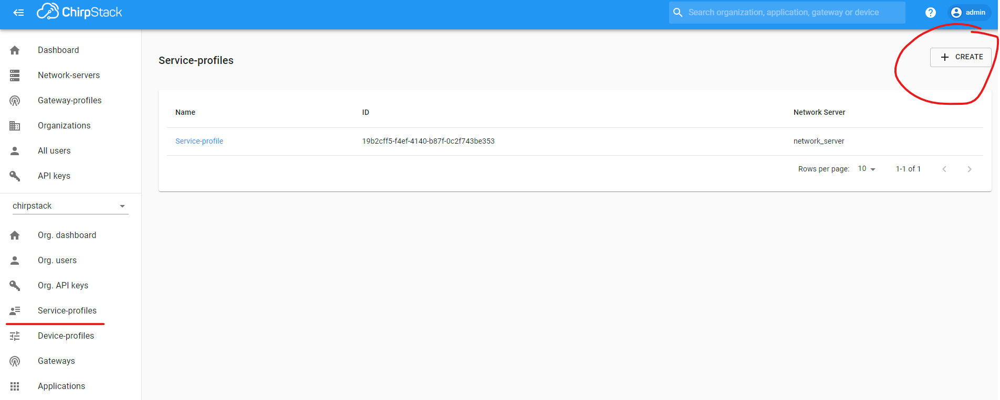
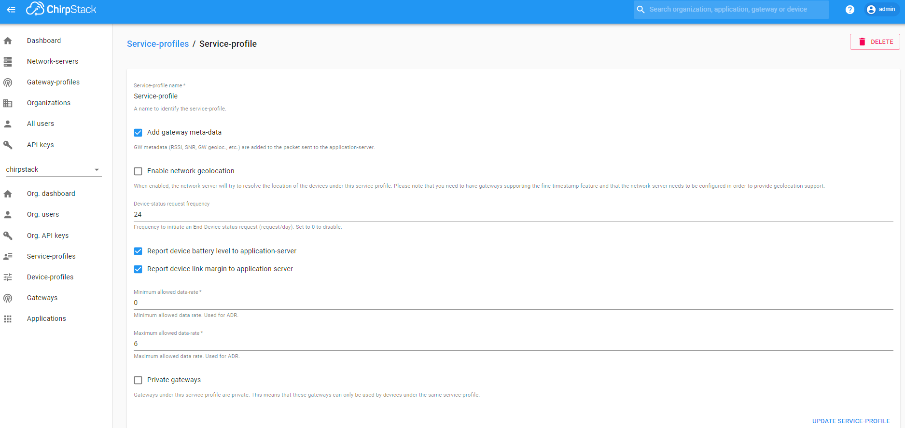
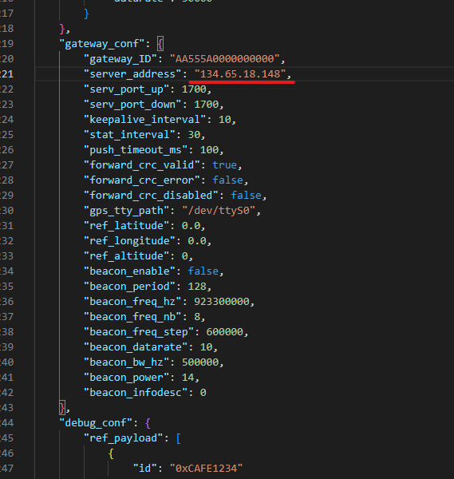
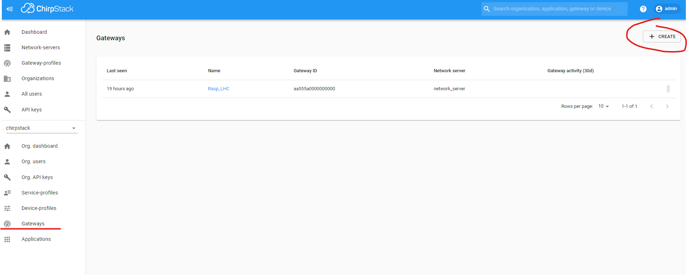
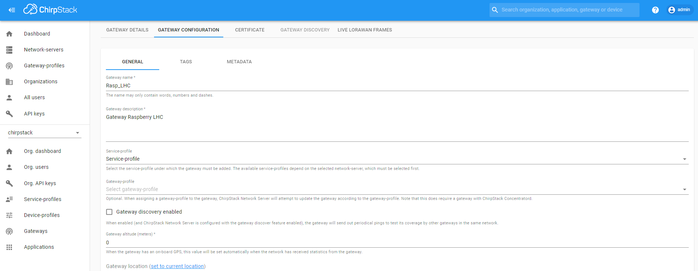
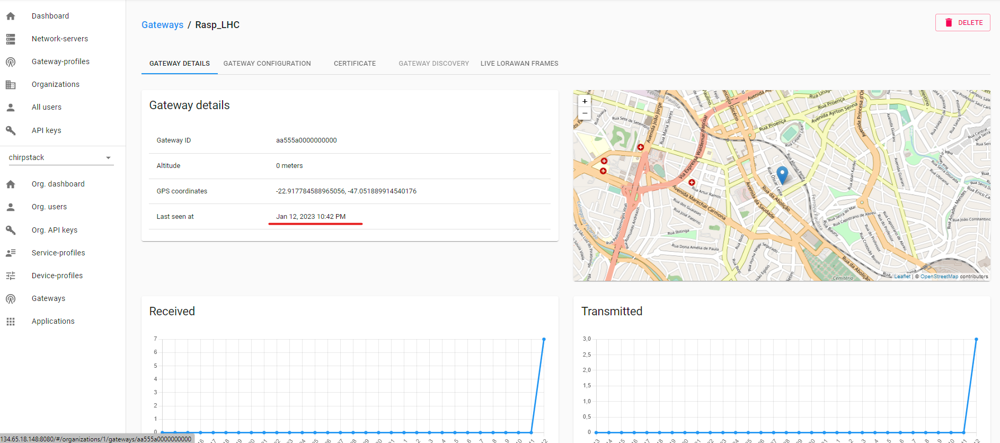

# LoRaWAN-101 - Setup

A primeira atividade que realizamos na oficina de LoRaWAN, foi de subir um servidor Chirpstack no servidor do LHC e montar um gateway usando uma Raspberry PI e módulo [WM1302](https://wiki.seeedstudio.com/WM1302_module/) da Seeed Studio.

## Setup Chirpstack

### 1° Passo - Deployment
A primeira etapa foi subir um servidor Chirpstack no servidor do LHC, foi criado um playbook Ansible para simplificar o processo de deployment. O playbook bem como os passos necessários para executa-lo podem ser encontrodos no repositório [Ansible](https://github.com/LeandroTE/chirpstack_builder_ansible)

Antes de rodar o playbook é necessário mudar o IP e incluir o caminho da chave privada (no arquivo inventory), para acessar o servidor remoto, segue um [tutorial](https://www.digitalocean.com/community/tutorials/how-to-set-up-ssh-keys-on-ubuntu-20-04-pt) explicando como criar um par de chaves no Digital ocean, porém o processo é bem similar para outros provedores de cloud.

### 2° Passo - Configuração Chirpstack

Após o deployment é configurar o chirpstack, após rodar o playbook com sucesso para acessar o servidor será apenas acessar o endereço de IP na porta 8080. No caso do servidor do LHC este pode ser acessado pelo endereço [134.65.18.148:8080](http://134.65.18.148:8080/).

O login padrão é (admin/admin), porém recomenda-se que assim que acessar o servidor a senha seja trocada para uma senha mais forte.

### Criação do Network Server

Para o funcionamento do Chirpstack é necessário a criação de um Network server através de menu lateral na esquerda.

Após criar o Network server configurar ele criando um nome e o endereço delo, conforme abaixo, o nome é livre, o endereço deve seguir o nome utilizado pelo arquivo docker compose, no nosso exemplo através do Ansible esse endereço será chirpstack-network-server:8000.

### Criação Service-Profile

Após a criação do network server é necessário criar o service profile através do menu da esquerda.

E após criação configurar ele conforme abaixo

## Configuração do Gateway

Para configurar o gateway seguir exatamente o [tutorial](https://wiki.seeedstudio.com/WM1302_module/#quick-start-with-wm1302) da SeeedStudio.

A única diferença é que devemos usar o arquivo de configuração para a frequência do Brasil (AU915) e modificar o endereço do network server para o mesmo IP do servidor que criamos no passo 1. 

Neste repositório colocamor o arquivo de configuração no exemplo do LHC, para um outro deploymento será apenas necessário trocar o IP.

## Cadastro do Gateway no Chirpstack

Após configurar o gateway Raspberry é necessário adicionar ele no Chirpstack, através do menu gateway.

Após adicionar o gateway seguir a configuração abaixo:

Caso todos os passos sejam seguidos sem problemas o gateway mandará dados para o Network server, isso pode ser verificado pelo campo last seen, que irá mudar de "never" para a horário.

.

## Conclusão

Com os passos acima temos um servidor LoRaWAN e um gateway funcionando. O próximo passo será cadastrar os dispositivos que iremos fazer nas próximas oficinas.

O servidor Chirpstack criado é aberto para testes, através do endereço [134.65.18.148:8080](http://134.65.18.148:8080/).

Foi criado um usário que permite criar e modificar dispositvos:

|login  | senha  |
|----------|----------|
|lhc@lhc.net.br|tijolo22 |

That's all folks